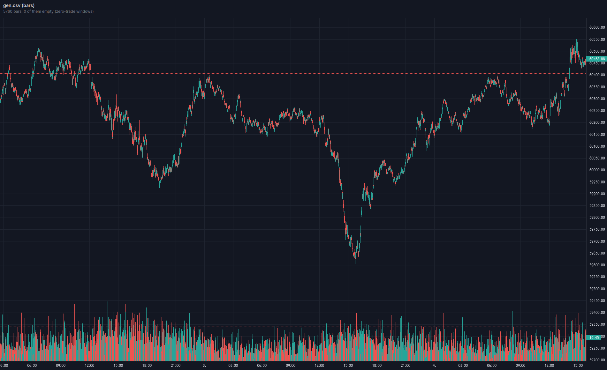

# mogwai

A fake broker/exchange that plugs into a
[NautilusTrader](https://github.com/nautechsystems/nautilus_trader) trading
system to exercise the *live* trading path. It synthesizes market data from a
committed fingerprint fitted offline to Kraken trade history (the running server
opens no CSV) and injects the messy, realistic execution divergences - partial
fills, rejects, ack delays, duplicate fills, dropped account updates, venue
blackouts, silent data stalls - that an in-process backtest sandbox structurally
cannot produce.



Four days of the synthetic tape, charted straight from the generator with no
venue and no network involved:

```sh
python3 analysis/plot_tape.py --gen --type bars --interval 1m --length 4d --seed 7 --open
```

What mogwai generates is a TRADE stream - individual raw fills, at a cadence
fitted to real trade archives. The bars above are only a rendering of it: 5,760
one-minute windows aggregated from those trades so four days fit on a screen,
none of them empty. Swap `--type bars --interval 1m` for `--type trades` to dump
the ticks themselves. The venue never serves a bar either - it streams trades,
and a client that wants candles aggregates them itself, which is what the
nautilus adapter does.

The seed is the whole of the reproduction: that command draws the same tape on
any machine running the same build.

A Cargo workspace of seven crates under `crates/`:

- `mogwai-protocol` - the JSON-over-WS wire types, the divergence catalog and
  the shipped launcher.
- `mogwai-engine` - the venue-agnostic exchange core and divergence seam.
- `mogwai-data` - the synthetic generator and the k-way tick merge.
- `mogwai-server` - the axum library owning sockets, clock and replay pacing.
- `mogwai-cli` - the `mogwai` binary: `serve` plus the offline generator and
  measurement subcommands.
- `mogwai-lab` - the offline corpus-to-fingerprint method library: corpus
  parsing, the measurement engine, fingerprint synthesis and the fit.
- `mogwai-adapter` - the nautilus venue adapter a host registers for the
  `MOGWAI` venue; the only crate that imports nautilus.

## Contents

- [Building](#building) - what needs a nautilus dependency and what does not
- [Usage](#usage) - the CLI, and what one venue is
  - [Driving it from a nautilus live node](#driving-it-from-a-nautilus-live-node)
  - [The launcher contract, for a launcher that is not Rust](#the-launcher-contract-for-a-launcher-that-is-not-rust)
- [Documentation](#documentation) - `docs/` for using it, `reference/` for changing it
- [License](#license) - AGPL-3.0-only, or commercial

## Building

The six broker crates build nautilus-free. `mogwai-adapter` depends on the
published nautilus crates from crates.io, pinned in its `Cargo.toml`
(default-features off, no pyo3), so a full build needs no sibling checkout -
cargo fetches nautilus like any other dependency.

Use `cargo` for check/test/run:

```sh
cargo clippy --all-targets               # lints
cargo test                               # the test suite
cargo run -p mogwai-cli -- serve         # one venue, endpoint printed on stdout
```

`serve` takes no address: it always binds loopback on an ephemeral port, so two
of those commands running at once cannot collide and cannot be pointed at each
other. The bound address comes back as one line of JSON on stdout - a launcher
captures it, a human reads it off the terminal.

To put a `mogwai` binary on your `PATH` instead, install it. Nothing here is
published to crates.io, so install from git or from a checkout - the package is
`mogwai-cli`, and the binary it installs is `mogwai`:

```sh
cargo install --git https://github.com/folknor/mogwai mogwai-cli
cargo install --path crates/mogwai-cli              # from a checkout
```

This build graph excludes `mogwai-adapter`, so it pulls no nautilus crates at
all, and the fingerprint and instrument presets are embedded at compile time -
the binary is self-contained, needing no data directory. `mogwai serve` runs one
venue in the FOREGROUND for one run and owns no PID, log or config files: it
never consults the working directory, so pass `serve --config <path>` to use
anything but the built-in defaults. There is no daemon mode and no `stop`
subcommand - the launcher owns the lifecycle, reading the bound address from the
readiness line on stdout; see [`docs/cli.md`](docs/cli.md).

Linux only, for now. The venue arms `PR_SET_PDEATHSIG` so the kernel terminates
it when its launcher dies, which is the whole of its cleanup story - there is no
PID file and no `stop` to fall back on - and that call is unconditional, so
`mogwai-server` does not build elsewhere, and neither does the `mogwai` binary.

## Usage

```sh
mogwai serve --config run.toml     # one venue, one run, foreground
mogwai presets MNQ                 # print a built-in instrument preset
mogwai gen --help                  # dump a tape offline, no venue involved
mogwai man cli                     # read a bundled doc; bare `man` lists topics
```

One venue is ONE RUN: one account and one ledger, on an ephemeral loopback port.
It is not a service you start once and point many strategies at - two
independent forward tests are two processes, not two clients of one venue.
Sockets may still be many (the adapter alone opens two, data and execution), but
they all speak for the same account, so anything they submit lands in one shared
ledger.

The INSTRUMENT SET IS OPEN, and the venue does not gate on it: a symbol that
arrives is served. If a tuned preset exists for it, that preset drives the tape;
if none does, the default tape is served under that symbol. So one run can serve
many symbols - each gets its own paced tape, and the config supplies the SHAPE a
requested symbol resolves to rather than declaring the run's one instrument.

### Driving it from a nautilus live node

The venue is a process, and the adapter is a pair of nautilus clients that
connect to it. A host starts one venue per run, learns where it landed, and
registers both clients for the `MOGWAI` venue.

```toml
[dependencies]
mogwai-adapter = { git = "https://github.com/folknor/mogwai" }
# Or, to launch a venue without importing nautilus at all - the launcher lives
# here and `mogwai-adapter` only re-exports it:
mogwai-protocol = { git = "https://github.com/folknor/mogwai" }
```

**Your nautilus version has to match the adapter's.** `mogwai-adapter` depends on
the published `nautilus-*` crates, pinned in its `Cargo.toml`. If your build
resolves a different version - or path-depends a checkout - cargo compiles two
distinct sets of nautilus types, and registering the factories fails with
errors of the form `expected ExecutionClient, found ExecutionClient`. Pin the
same version on both sides; a `[patch.crates-io]` cannot bridge a minor-version
gap, because `0.61` means `>=0.61.0, <0.62.0`.

```rust
use std::time::Duration;

use mogwai_adapter::{
    MogwaiDataClientConfig, MogwaiDataClientFactory,
    MogwaiExecClientConfig, MogwaiExecutionClientFactory,
    launch::{LaunchSpec, StderrSink, launch},
};
use nautilus_model::identifiers::AccountId;

// 1. Start this run's venue. There is no address to configure - the venue binds
//    an ephemeral loopback port and reports it. Holding the returned guard is
//    what keeps the venue alive; dropping it kills and reaps the process.
let venue = launch(LaunchSpec {
    config: Some("run.toml".into()),
    duration: Some(Duration::from_secs(600)), // SIM time, not wall time
    stderr: StderrSink::Lines(Box::new(|line| tracing::info!("mogwai: {line}"))),
    ..LaunchSpec::default()
})?;

// 2. Both clients speak for ONE account against ONE ledger, so they take one
//    account id - nothing on the wire notices if they disagree - and `for_run`
//    binds them to THIS run rather than to the address it happened to land on.
//    The port is ephemeral and is freed before the venue exits, so a client
//    that only knows where to dial cannot tell its own run from whatever
//    answers there next.
let account_id = AccountId::from("MOGWAI-001");
let data = MogwaiDataClientConfig::for_run(venue.record(), account_id.clone());
let exec = MogwaiExecClientConfig::for_run(venue.record(), account_id);

// 3. Register the pair.
let builder = builder
    .add_data_client(None, Box::new(MogwaiDataClientFactory::new()), Box::new(data))?
    .add_exec_client(None, Box::new(MogwaiExecutionClientFactory::new()), Box::new(exec))?;
```

`launch` can be called from anywhere, including an async task: the guard owns a
dedicated OS thread internally, so the caller's runtime cannot shorten the
venue's life.

Three things worth knowing at the call site. The venue's own knobs - `warmup_ns`,
`[balances]`, the instrument shapes and the default `speed` - live in the file
passed as `config`, and the host restates none of them; a client picks its own
symbol and pacing on the socket it opens. Trading a futures preset wants
`.with_account_type(AccountType::Margin)` on the exec config, because a nautilus
`CashAccount` has nowhere to keep the margin rows the venue reports and drops
them client-side. And divergences are armed either per-client with
`.with_havoc(..)` or at runtime over `POST /control/divergence`; see
[`docs/havoc.md`](docs/havoc.md).

### The launcher contract, for a launcher that is not Rust

A Rust host needs none of this - `launch` above is it. Written out because a
launcher in another language has to implement it, and because every step is
load-bearing rather than conventional:

1. Spawn `mogwai serve` as a **direct** child, capturing stdout.
2. Read one line of stdout: a JSON `ReadyRecord`. Check its `version` first, then
   use its `addr`. The record names no instrument; a launcher needing one takes
   it from its own configuration. Stdout closing without a line means the venue
   failed to boot, and its stderr says why. The read blocks for as long as
   warmup generation takes, so bound it yourself and treat expiry as a boot
   failure.
3. Drain stderr continuously, or send it to a file or the null device. Logs go
   to stderr by design, a pipe holds about 64 KiB, and a full pipe blocks the
   writer - so a capture nobody reads wedges the venue mid-run, which at the
   socket is indistinguishable from a hang.
4. On `RunComplete` the venue exits 0 by itself; otherwise terminate it.

"Direct child" is load-bearing rather than stylistic: the venue arms
`PR_SET_PDEATHSIG` against its immediate parent, so a shell, a `cargo run`, or a
double fork in between wires the death watch to the wrapper and leaves a real
orphan behind. The signal also tracks the parent THREAD, so spawn from a thread
that outlives the run or the venue dies mid-run under a healthy launcher.
`scripts/smoke.py` is this contract executed in Python, and is the reference to
copy from.

## Documentation

Split by subject rather than audience. `docs/` is how the venue is USED, and
`reference/` is how it is BUILT and why - what you need in order to change it
safely. Both are binding: what they say has to be true.

Using it:

- [`docs/cli.md`](docs/cli.md) - the `mogwai` command line and the launcher
  contract.
- [`docs/config.md`](docs/config.md) - the run configuration file, knob by knob.
- [`docs/havoc.md`](docs/havoc.md) - every divergence variant, the four havoc
  surfaces, and the validation boundaries.
- [`docs/presets.md`](docs/presets.md) - the three instrument presets shipped
  inside the binary, how a requested symbol resolves to one, and their
  provenance.
- [`docs/oms-types.md`](docs/oms-types.md) - the run-level `oms_type` choice,
  and how netting and hedging differ on the wire.

Changing it:

- [`reference/architecture.md`](reference/architecture.md) - how the system
  works, subsystem by subsystem, including the HTTP/WS routes.
- [`reference/clock.md`](reference/clock.md) - the simulated clock, and what
  accelerating a run does and does not change.
- [`reference/glossary.md`](reference/glossary.md) - the identity chain the code
  builds: run, tape, ledger and the instrument vocabulary.
- [`reference/performance.md`](reference/performance.md) - the durable record of
  measured numbers, with the method behind each.
- [`reference/technical-implementation-spec.md`](reference/technical-implementation-spec.md)
  - what an implementation spec for this repo must contain.

Everything in `docs/`, plus `architecture` and `clock`, is compiled into the
binary: `mogwai man <topic>` renders one in the terminal and `mogwai man` lists
them, so an installed `mogwai` carries its own documentation with no source tree
present. Colour is dropped when stdout is not a terminal or `NO_COLOR` is set.
The rest of `reference/` serves someone editing this repo, who has the files.

Codebase conventions and build rules live in `AGENTS.md`. Transient work items,
plans and analysis live in `notes/`; the offline fingerprint-fitting pipeline is
`analysis/`.

## Acknowledgements and disclaimers

I want to thank [Nautech Systems](https://nautilustrader.io/) for their incredible software, upon which mogwai rests.

This is an independent community project. It is not affiliated with, endorsed by, or supported by Nautech Systems Pty Ltd or the official NautilusTrader project.

## License

mogwai is dual-licensed:

- **AGPL-3.0-only** for everyone - see [LICENSE](LICENSE). If you convey the
  software or offer it over a network, the AGPL's source-sharing obligations
  apply to your work.
- **Commercial licenses** for proprietary use without copyleft obligations -
  see [COMMERCIAL-LICENSE.md](COMMERCIAL-LICENSE.md).

All versions in this repository's history, including commits that predate the
LICENSE file, are licensed under the AGPL-3.0-only.

Contributions require agreeing to the [CLA](CLA.md), which assigns copyright to
the project owner and keeps dual licensing possible. You retain a full license
back to your own contributions.
